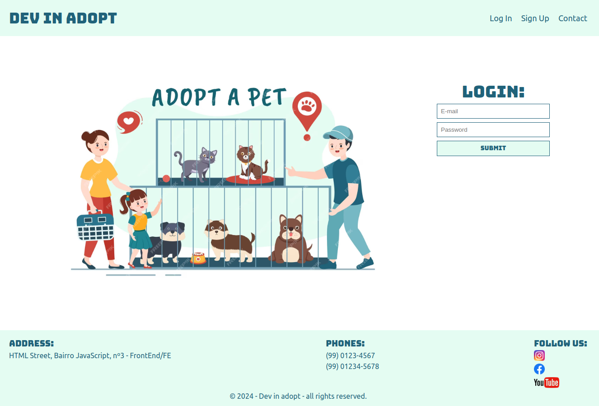

<h1 align="center">
    <a href="#" alt="site do ecoleta">DEV FOR ADOPT</a>
</h1>

<h3 align="center">

    Dev for adopt é uma landing page desenvolvida para uma empresa fictícia de adoção de animais.  

</h3>

  
  
  
   
   
  

<h4 align="center">
	🚧 STATUS: Projeto concluído 🚧
</h4>

# Tabela de conteúdos

- [Sobre o projeto](#-sobre-o-projeto)
- [Estrutura do projeto](#-estrutura-do-projeto)
- [Funcionalidades](#-funcionalidades)
- [Tecnologias](#-tecnologias)
- [Acesse a página](#-acesse-a-página)
- [Visualizando a página](#-visualizando-a-página)
- [Autor](#-autor)
- [Licença](#-licença)
- [Outras considerações](#-outras-considerações)

## 💻 Sobre o projeto

Dev for adopt é uma landing page desenvolvida para uma empresa **fictícia** de adoção de animais.

O projeto desenvolvido teve como iniciativa um exercício do curso **Engenheiro front-end** da **EBAC**, ao qual estou participando.

A landing page foi criada apenas com **HTML** e **CSS** e possui alguns recursos como **imagens**, **links** e **formulários**.

## ⚙️ Estrutura do projeto

- O projeto é composto por:
  - Uma página web: **(main.html)**
    - Header: Possui o título principal da página e também um menu para navegação entre as seções.
    - Body:Possui uma imagem (logo da empresa) e também um formulário para login no site.
    - Footer: Possui as informações de contato e os links para as redes sociais da empresa.
  - Um arquivo de estilização: **index.css**
  - Uma pasta **(assets)** com as imagens utilizadas na construção da página web.

## 🎲 Funcionalidades

As funcionalidades desenvolvidas no projeto foram:

- [x] Navegação intuitiva: A landing page possui uma navegação clara e simples, com links para seções importantes da página.
- [x] Login: Possui um formulário que pode ser utilizado para fazer o acesso a área de membros do site.
- [x] Informações de localização e contato: Possui um espaço onde fornece o endereço da loja e também os telefones para contato.
- [x] Links: Possui links para as redes sociais da loja.

## 🛠 Tecnologias

Foi utilizado na construção do projeto as seguintes tecnologias:

<code></code> **HTML**
<code></code> **CSS**
<code></code> **JavaScript**
<code></code> **Git**
<code></code> **GitHub**

## ✈️ Acesse a Página

Este projeto encontra-se hospedado na plataforma da [Vercel](https://vercel.com/).

#### Pode ser visualizado clicando aqui: [Dev for adopt](https://dev-in-adopt.vercel.app/)

## 👀 Visualizando a Página

Abaixo é possível visualizar a página web desenvolvida:

## 🦸 Autor

<a href="https://github.com/bcadore">
    
     
    <b>Bernardo Cadore Ramires</b>
</a>

 

## 📝 Licença

Este projeto esta sobe a licença [MIT](./LICENSE).

## ⚠️ Outras considerações

👉 **Este projeto é parte de uma tarefa educacional, mas sinta-se à vontade para fornecer feedback ou sugestões de melhorias.**

👉 **A responsividade da página não foi levada em questão.**
 

❤️  <b>MUITO OBRIGADO</b> por visitar o meu projeto! ❤️

---
